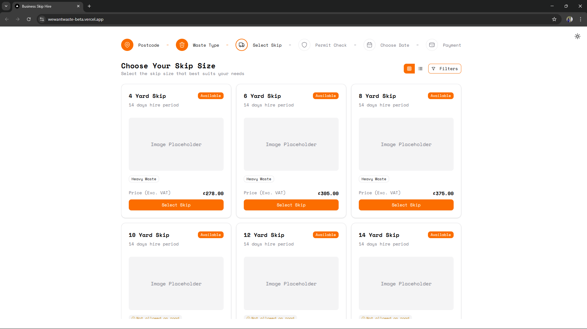

# WeWantWaste Code Challenge



A modern redesign of the "Choose Your Skip Size" page from [wewantwaste.co.uk](https://wewantwaste.co.uk/), enhancing the skip selection experience with an intuitive, accessible, and visually appealing interface.

## Overview

This project completely reimagines the skip selection process of the original website. After entering a postcode (such as LE10 1SH) and selecting "garden waste" on the original site, users encounter a basic skip selection page that lacks visual appeal and modern UX patterns.

My redesigned interface transforms this critical selection phase with:

- **Visual-First Selection**: Clear visualization of different skip sizes and types
- **Intuitive Filtering System**: Easy filtering by size, placement requirements, and compatibility
- **Dual View Options**: Toggle between grid and list views based on user preference
- **Responsive Design**: Seamless experience across mobile, tablet, and desktop devices
- **Accessible UI Components**: Built with accessibility in mind using shadcn/ui components

## Tech Stack

### Core Technologies
- **Framework**: [Next.js 15](https://nextjs.org/) with App Router for server-side rendering and routing
- **Language**: [TypeScript](https://www.typescriptlang.org/) for type safety and developer experience
- **Styling**: [Tailwind CSS](https://tailwindcss.com/) for utility-first styling and responsive design

### UI Components
- **Component Library**: [shadcn/ui](https://ui.shadcn.com/) - Selected for its:
  - Non-opinionated approach allowing high customization
  - Accessible, reusable components built on Radix UI primitives
  - Seamless integration with Tailwind CSS
  - Component-first approach rather than traditional library imports
- **Icons**: [Lucide React](https://lucide.dev/) for consistent iconography
- **Theme Support**: [next-themes](https://github.com/pacocoursey/next-themes) for light/dark mode

### Data Management
- **Server Actions**: Next.js server actions for data mutations
- **State Management**: React Context API for application state
- **Data Fetching**: [TanStack Query](https://tanstack.com/query/latest) for:
  - Efficient data fetching with automatic caching
  - Background data refreshing
  - Loading and error state management
  - Server-side rendering support

### UI/UX Enhancements
- **Drawer Component**: [Vaul](https://vaul.emilkowal.ski/) for smooth, accessible drawer animations
- **Step Navigation**: Custom stepper component for multi-step process
- **Error Handling**: [react-error-boundary](https://github.com/bvaughn/react-error-boundary) for graceful error handling

## Design Approach

The redesign focuses on several key principles:

1. **User-Centric Design**: Skip selection is simplified with clear visual indicators for size, placement options (road legal vs. private land), and waste type compatibility
   
2. **Visual Hierarchy**: Important information like skip size, availability, and pricing is prominently displayed

3. **Filtering Experience**: Advanced filtering with real-time updates and count indicators help users quickly narrow down options

4. **Visual Feedback**: Selected skips are clearly highlighted with distinctive borders and interactive elements

5. **Information Architecture**: Critical details are organized in a consistent, scannable layout in both grid and list views

## Focus

This project emphasizes:

- **Clean, Maintainable React Code**: The codebase is organized into clear, reusable components and hooks, following best practices for readability and scalability. TypeScript is used throughout for type safety and improved developer experience.
- **Responsiveness**: Every component and layout is designed mobile-first, ensuring a seamless experience across all device sizes. Tailwind CSS utility classes and responsive design patterns are used extensively.
- **UI/UX Improvements**: The redesign prioritizes user experience with intuitive navigation, accessible components (via shadcn/ui), and clear visual feedback. Filtering, selection, and step navigation are all optimized for clarity and ease of use, making the skip selection process fast and enjoyable.

## Folder Structure

```
app/
  favicon.ico
  globals.css
  layout.tsx
  loading.tsx
  page.tsx
components/
  empty-placeholder.tsx
  icons.tsx
  providers.tsx
  skips/
    selection-button.tsx
    skip-card.tsx
    skip-list-item.tsx
    skip-summary-drawer.tsx
    skips-layout.tsx
    controls/
      filter.tsx
      view-mode.tsx
  steps/
    step-item.tsx
    stepper.tsx
  theme/
    provider.tsx
    togger.tsx
  ui/
    badge.tsx
    button.tsx
    card.tsx
    command.tsx
    dialog.tsx
    drawer.tsx
    popover.tsx
    scroll-area.tsx
    sheet.tsx
    skeleton.tsx
config/
  menu.ts
  skips.ts
context/
  skips-context.tsx
hooks/
  use-mobile.ts
lib/
  utils.ts
types/
  skips.ts
  steps.ts
```

## Getting Started

First, run the development server:

```bash
npm run dev
# or
yarn dev
# or
pnpm dev
# or
bun dev
```

Open [http://localhost:3000](http://localhost:3000) with your browser to see the result.

You can start editing the page by modifying `app/page.tsx`. The page auto-updates as you edit the file.

This project uses [`next/font`](https://nextjs.org/docs/app/building-your-application/optimizing/fonts) to automatically optimize and load [Geist](https://vercel.com/font), a new font family for Vercel.

## Learn More

To learn more about Next.js, take a look at the following resources:

- [Next.js Documentation](https://nextjs.org/docs) - learn about Next.js features and API.
- [Learn Next.js](https://nextjs.org/learn) - an interactive Next.js tutorial.

You can check out [the Next.js GitHub repository](https://github.com/vercel/next.js) - your feedback and contributions are welcome!

## Deploy on Vercel

The easiest way to deploy your Next.js app is to use the [Vercel Platform](https://vercel.com/new?utm_medium=default-template&filter=next.js&utm_source=create-next-app&utm_campaign=create-next-app-readme) from the creators of Next.js.

Check out our [Next.js deployment documentation](https://nextjs.org/docs/app/building-your-application/deploying) for more details.
